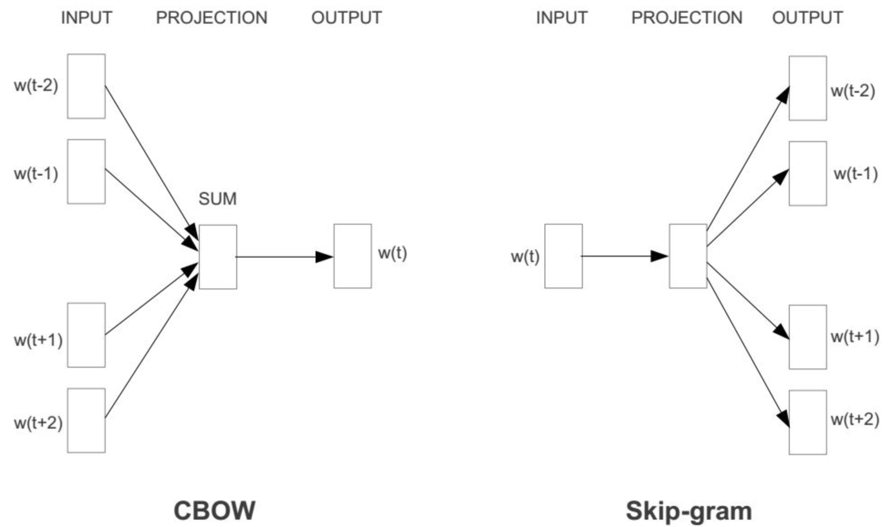

# 词嵌入

> 2024/07/10

在大模型的 RAG（检索增强生成） 应用中有一个核心步骤-**词嵌入**，它是 RAG 应用能从外挂知识库中进行检索的基石。通过词嵌入 RAG 应用将知识库文本转化为语义向量并存入到向量库中。当用户向 RAG 应用提问时，RAG 应用再把用户的问题（prompt）转化为 prompt 语义向量，并在向量库中检索出与 prompt 语义向量相近的知识库文本语义向量，然后取出对应的知识库文本作为 Prompt 的上下文提供给大模型，以增强大模型在某些任务或领域上的能力。

从这个过程程中可以看出，词嵌入似乎是 RAG 应用能够理解人类语言的核心，那么这里有两个问题：

1. 词嵌入是什么？
2. 语义向量是什么？

### **分词处理和独热编码（one-hot）**

机器理解人类语言是通过词与词之间的关联关系来做到的，这种关联关系即语义关系。比如在机器学习过程中，机器会发现“苹果”与“橘子”的语义相近，“hello” 和 “world” 经常一起出现。

要表达词与词的关联关系，首先就是要对人类语言进行数字化处理，这通常分为两部分：分词处理和编码。

分词处理的方式有很多种，比如按照字节分词，按照单词分词或者按照词根分词，经过分词处理后就形成了一个个 token 组成的词汇表（vocabulary）。

至于编码最为常见的就是 [独热编码(one-hot)](https://en.wikipedia.org/wiki/One-hot) ，例如词汇表中有 “苹果”， “香蕉” 和 “华为” 3 个 token，使用独热编码的向量化表示如下图所示：



独热编码具有如下特征：

从信息的角度，**对 token 使用独热编码，使得每一个 token 都有自己的维度，每一个维度都代表着某个 token 的语义，也就是说使用独热编码对于 token 的语义信息来说是无损的**，这是独热编码的优势。

从向量的角度，**对 token 使用独热编码相当于将所有的 token 都转化为相互正交且模长相等的向量，这些向量由于相互正交，内积为 0，所以向量之间并不存在远近关系，从而也就无法体现 token 之间的语义关系**。

从空间的角度，**对 token 使用独热编码相当于将所有的 token 都投入到一个高维的空间中，这个高维空间的信息密度极低，其空间维度数量等于 token 数量，这导致了极高的空间复杂性，相对应的带来的结果就是计算效率低下**。

我们期望 token 数字化以后可以体现 token 之间的语义关系，比如“苹果”在水果这个维度上的值应该与“香蕉”相近，作为手机在电子产品这个维度上应该与华为相近。比如第一个维度代表水果语义，第二个维度作为电子产品语义，则“苹果”、 “香蕉” 和 “华为” 的向量化表示大概应该是这样：


### 嵌入矩阵

一般对于词嵌入来说需要对独热编码向量进行 **降维处理**。

比如词汇表中有 N 个 token，那么每一个 token 就是一个 N 维向量，相应的嵌入矩阵就是则是一个 N X D 的矩阵，将 token 向量作为一个 1 X N 的矩阵与这个 N X D 的矩阵相乘，就得到了一个 1 X D 的矩阵，即一个 D 维向量，我们暂且称之为词向量。


这个 N X D 的矩阵被称为**嵌入矩阵**，这个过程被称为词嵌入（Word Embedding）。嵌入矩阵中的的 N 被称为词汇量，即词汇表的大小，而 D 被称为嵌入维度，我们也可以将 D 理解为语义维度。

事实上，目前大多数 AI 模型都具有嵌入维度和词汇表的大小参数，比如使用 `transformer` 库加载 `distilbert-base-uncased` 模型的参数并打印：

```python
from transformers import AutoConfig;

config = AutoConfig.from_pretrained("distilbert-base-uncased")
print(config)
```

可以看到如下输出

```python
DistilBertConfig {
  "_name_or_path": "distilbert-base-uncased",
  "activation": "gelu",
  "architectures": [
    "DistilBertForMaskedLM"
  ],
  "attention_dropout": 0.1,
  "dim": 768,
  "dropout": 0.1,
  "hidden_dim": 3072,
  "initializer_range": 0.02,
  "max_position_embeddings": 512,
  "model_type": "distilbert",
  "n_heads": 12,
  "n_layers": 6,
  "pad_token_id": 0,
  "qa_dropout": 0.1,
  "seq_classif_dropout": 0.2,
  "sinusoidal_pos_embds": false,
  "tie_weights_": true,
  "transformers_version": "4.40.1",
  "vocab_size": 30522
}
```

其中 `dim` 是嵌入维度，`vocab_size` 是词汇表的大小。

仔细分析一下词嵌入的过程中到底发生了什么？带来了什么变化？

从信息的角度，维度降低，这意味着向量所代表的语义信息有了损失。举个例子说明：“苹果”的独热编码可以表达苹果本身所有语义，因为这个向量的某个维度的语义就是代表苹果，但是在经过词嵌入以后，向量的维度所代表的语义可能分别变成了水果、颜色、 味道、物理性质等等，但是这只是对苹果这个向量的所有特征的描述，并不能完全表达出“苹果”一词的完整语义。

从向量的角度，经过词嵌入（与嵌入矩阵相乘）所有的词向量之间变得不再相互正交，也即能表达出词向量与词向量之间的远近关系，这种远近关系可以用来表示词与词之间的语义关系

从空间的角度，词嵌入是将 one-hot 编码出的高维向量丛高维空间嵌入到低维空间。_（PS: 嵌入的意思就是指将一个向量丛一个空间嵌入到另一个空间）_。新的向量空间中的信息密度远高于原本的空间。

因此词嵌入的过程，其实也是信息被压缩的过程，也就是说嵌入维度越小，信息被压缩的越厉害，相应的每个词向量能表达的语义越少，但是其好处是，在新的语义空间中，信息更加密集，更加容易体现词之间的关系，后续的计算和存储成本就越低。

嵌入矩阵除了改变向量维度以外，更为重要的功能是：**通过该矩阵进行转换后的新的空间内，要能体现出词向量与词向量之间的语义关系**，这几乎无法通过硬编码的方式做到。

### 嵌入矩阵是哪里来的？

嵌入矩阵一般通过机器学习和深度学习训练得来，以 [Word2Vec](https://en.wikipedia.org/wiki/Word2vec) 为例， Word2Vec 是一种用于自然语言处理的技术，该技术的核心思想是通过深度学习的方法，将词语映射到一个连续的向量空间，使得在这个空间中，语义上相似的词语距离较近。Word2Vec 具体包括两种模型架构：连续词袋模型（CBOW，Continuous Bag-of-Words）和 Skip-Gram 模型。

CBOW 模型和 Skip-Gram 模型互为镜像：



CBOW 模型训练的大体思路是，将一个包含奇数个 token 的语句，拿掉中间的 token，然后将其他的 token 投入嵌入矩阵中，再将得到嵌入后的词向量加起来得到一个新向量并将这个新向量进行解码，看是否与被拿掉的 token 相同，最后根据对比结果的差异调整矩阵参数。

CBOW 模型训练的原理类似于受力分析，语义关系都需要根据上下文来，如果只能从一段文本中才能理解一个token 的语义，那么也就是能且只能通过上下文来推断。反之，根据上下文也应该能推断出 token 语义 ， 只是这种推断的方式在这里体现为向量相加。

Skip-gram 则与 CBOW 完全相反，它的训练思路是，通过一个 token 去推断其上下文的 token。


### Something More
+ AI 大模型的训练和运行大多数时候都是在进行矩阵运算，这也就不难理解为何显卡对于 AI 来说如此的重要，因为此前显卡的主要工作是进行图形处理，本质上也是在进行矩阵运算。

+ 虽然经过词嵌入产生的词向量的每一个维度都代表了一种独立语义，但是实际上生成的语义应该是人类不可读的，因为嵌入矩阵是通过机器学习得来的，因此很多东西都被黑盒化了。


